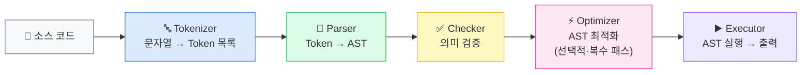
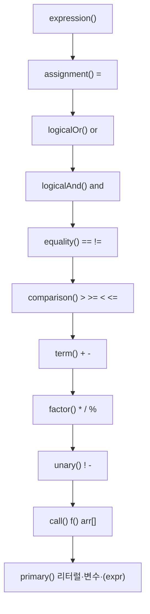
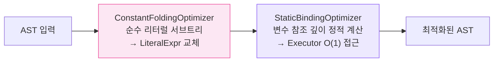

<div align="center">

# CodeFab Interpreter

**C++ 기반 커스텀 언어 인터프리터**


</div>

---

## 📖 사용자 메뉴얼

<div align="center">

언어 문법, 예시 코드, 오류 메시지, 공장 제어 쉘 사용법은 아래 문서를 참고하세요.

### 👉 [CodeFab Interpreter 사용자 메뉴얼 바로가기](https://jwoonng.github.io/CRA_Interpreter_B)

> 변수 · 출력 · 연산자 · 조건문 · 반복문 · 함수 · 배열 · 스코프  
> 예시 코드 · 오류 메시지 · 공장 제어 쉘 사용법 포함

</div>

---

<details>
<summary><h2>🏗️ 구조</h2></summary>

<br>

### 파이프라인



Shell이 이 파이프라인을 **REPL · 파일 · 디버그** 세 가지 모드로 감싼다.

---

### 디렉터리 구조

```
📦 factory
├── 📂 src/
│   ├── 📂 common/        Token, Expr, Stmt 공유 타입
│   ├── 📂 assembler/     Tokenizer, Parser
│   ├── 📂 checker/       Checker
│   ├── 📂 executor/      Executor, Environment
│   ├── 📂 optimizer/     IOptimizer, ConstantFoldingOptimizer, StaticBindingOptimizer
│   └── 📂 shell/         Shell, Debugger
│
├── 📂 test/
│   ├── Tokenizer_test.cpp
│   ├── Parser_test.cpp
│   ├── Checker_test.cpp
│   ├── Executor_test.cpp
│   ├── Function_test.cpp
│   ├── Array_test.cpp
│   ├── Shell_test.cpp
│   ├── Script_test.cpp
│   ├── StaticBinding_test.cpp
│   ├── ConstantFoldingOptimizer_test.cpp
│   ├── ShellConstantFoldingOptimizer_test.cpp
│   ├── Debug_test.cpp
│   └── FileMode_test.cpp
│
├── main.cpp              Release 진입점 (공장 제어 쉘)
└── test_main.cpp         Debug 진입점 (Google Test)
```

---

### 빌드 및 실행

**환경**: Visual Studio 2022 · Windows · C++20 · Google Test 1.11.0 (NuGet)

진입점은 빌드 구성에 따라 분리된다. `vcxproj`의 `ExcludedFromBuild`로 구성별 전환된다.

| 구성 | 진입점 | 용도 |
|------|--------|------|
| Debug | `test_main.cpp` | Google Test 전체 실행 |
| Release | `main.cpp` | 공장 제어 쉘 (REPL / 파일 / 디버그 모드) |

```sh
# Debug — 테스트 실행
msbuild factory.vcxproj /p:Configuration=Debug /p:Platform=x64
.\x64\Debug\factory.exe
.\x64\Debug\factory.exe --gtest_filter=ShellTest.*

# Release — 공장 제어 쉘
msbuild factory.vcxproj /p:Configuration=Release /p:Platform=x64
.\x64\Release\factory.exe                        # REPL
.\x64\Release\factory.exe run <파일경로>          # 파일 모드
.\x64\Release\factory.exe debug <파일경로>        # 디버그 모드
```

---

### 모듈별 상세

<details>
<summary><b>Tokenizer</b> — 어휘 분석</summary>

<br>

**인터페이스**: `tokenize(string) → vector<Token>`

소스 문자열을 한 번만 순회하여 Token 목록을 생성한다.

| 분류 | 목록 |
|------|------|
| 키워드 | `var` `if` `else` `for` `true` `false` `and` `or` `print` `func` `return` |
| 단일 연산자 | `+` `-` `*` `/` `%` `!` `=` `>` `<` `(` `)` `{` `}` `[` `]` `;` `,` |
| 복합 연산자 | `==` `!=` `>=` `<=` |
| 리터럴 | `NUMBER`(double) · `STRING` · `IDENTIFIER` |

</details>

<details>
<summary><b>Parser</b> — 구문 분석</summary>

<br>

**인터페이스**: `parse(vector<Token>) → vector<StmtPtr>`

재귀 하향(Recursive Descent) 방식으로 AST를 생성한다.



**디자인 패턴**: Composite — `BlockStmt`·`BinaryExpr` 등 모든 노드가 동일한 `accept()` 인터페이스를 제공해 Visitor가 트리를 구분 없이 순회한다.

</details>

<details>
<summary><b>Checker</b> — 의미 분석</summary>

<br>

**인터페이스**: `check(vector<StmtPtr>) → void`

AST를 순회하여 실행 전 검출 가능한 의미 오류를 `CheckError`(행 번호 포함)로 던진다.

스코프를 `vector<unordered_map<string, bool>>`로 관리한다. `bool`은 변수 초기화 완료 여부.

| 함수 | 동작 |
|------|------|
| `declare(name)` | 현재 스코프에 `false` 등록 (중복 시 오류) |
| `define(name)` | 현재 스코프 값을 `true`로 변경 |
| `resolveVar(name)` | 안쪽 스코프부터 탐색, `false`이면 자기 참조 오류 |

**디자인 패턴**: Visitor — `ExprVisitor`·`StmtVisitor` 인터페이스 구현. 노드 클래스를 수정하지 않고 새로운 의미 검사 로직 추가 가능.

</details>

<details>
<summary><b>Executor</b> — 실행</summary>

<br>

**인터페이스**: `execute(vector<StmtPtr>, ostream&) → void`

AST를 Visitor 패턴으로 순회하며 실행하고 결과를 `ostream`으로 출력한다.

```
Environment
├── values: map<string, LiteralValue>
└── enclosing: Environment*   ← 상위 스코프 포인터
```

블록 진입 시 새 `Environment` 생성, `ScopeGuard` RAII로 탈출 시 자동 복구.

**디자인 패턴**:
- **Visitor** — 각 노드 타입별 실행 로직을 단일 클래스에 집중
- **RAII / ScopeGuard** — 예외 발생 시에도 스코프 환경 오염 방지
- **Observer** — `DebugObserver*`가 `nullptr`이면 오버헤드 없이 실행, 디버그 모드에서 `Debugger` 주입 시 매 Stmt 전 `beforeStatement()` 호출

</details>

<details>
<summary><b>Optimizer</b> — AST 최적화</summary>

<br>

**인터페이스**: `optimize(vector<StmtPtr>) → vector<StmtPtr>`



**디자인 패턴**: Strategy · Chain of Responsibility · Null Object
- `IOptimizer` 인터페이스 뒤로 알고리즘을 숨겨 Shell 코드 변경 없이 교체·추가 가능
- `addOptimizer()`로 여러 패스를 순서대로 연결, 각 패스의 출력이 다음 패스의 입력

</details>

<details>
<summary><b>Shell</b> — 파이프라인 통합</summary>

<br>

**담당 파일**: `src/shell/Shell.h/.cpp`

4단계 파이프라인 전체를 묶어 REPL·파일·디버그 모드로 제공한다.

| 메서드 | 설명 |
|--------|------|
| `run(istream&, ostream&)` | `"> "` 프롬프트 출력하며 줄 단위로 읽어 실행 (REPL) |
| `runFile(path, ostream&)` | 소스 파일을 문장 단위로 실행, 에러 발생 전 출력 보존 |
| `runDebug(path, istream&, ostream&)` | Debugger 연결해 Stmt 단위로 정지하며 실행 |
| `runLine(string) → string` | 한 줄 실행 후 출력 반환 (테스트 전용) |

**디자인 패턴**: Dependency Injection — `Shell`이 구체 클래스 대신 인터페이스(`ITokenizer`, `IParser`, `IChecker`, `IExecutor`)에 의존. DI 생성자로 Mock 객체를 주입받아 파이프라인 특정 단계를 격리 검증 가능.

</details>

</details>

---

<details>
<summary><h2>👥 팀 소개</h2></summary>

<br>

**팀명**: Build Clean

> 동작하는 코드에서 끝나지 않고, 읽기 쉽고 유지보수하기 좋은 클린 코드를 만들자.

| 역할 | 이름 |
|------|------|
| 팀장 | 우상욱 님 |
| 팀원 | 최종원 님 |
| 팀원 | 이수련 님 |
| 팀원 | 임지웅 님 |

**담당**

| 이름 | 담당 모듈 | 경로 | 추가 역할 |
|------|----------|------|----------|
| 임지웅 님 | Tokenizer (어휘 분석) | `src/assembler/Tokenizer` | 버그 수정 |
| 최종원 님 | Parser (구문 분석) | `src/assembler/Parser` | 자료 작성 |
| 최종원 님 | Shell (REPL 통합) | `src/shell/Shell` | |
| 이수련 님 | Checker (의미 분석) | `src/checker/Checker` | Interpreter 안정성 검증 |
| 우상욱 님 | Executor (실행) | `src/executor/Executor` | 메뉴얼 작성 |

---

### Ground Rule

- **17시 퇴근하기**

**개발 전략**

- 전체 directory 구조 먼저 생성
- 각 feature별 Branch를 만들어 개발 진행
- Branch naming: `feature/assem.../sub기능`
- 함수·변수명 snake_case
- 필요한 클래스 생성 및 호출은 header에서 진행
- 공통 라이브러리는 `common/`에서 개발
- 가능한 모듈 동시 개발

**PR 전략**

- GitHub 전담 관리자: PR + Merge 시 commit 품질 관리
- PR template 활용
- Approve 1명 이상
- Build Check(Error 제거 확인) 후 PR
- Master merge 전 개인 Branch에 Master merge 후 Push
- 순차적으로 PR 및 Merge
- 16시 30분 이후 PR 금지
- 개발 Branch는 PR 후 삭제

**Comment 말머리**

| 태그 | 의미 |
|------|------|
| `[Must]` | 반드시 수정 필요 |
| `[Recommend]` | 권장 사항 |
| `[Question]` | 궁금한 점 |
| `[Nit]` | 사소한 제안 |
| `[Praise]` | 좋았던 점 |

</details>
