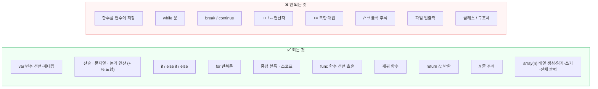
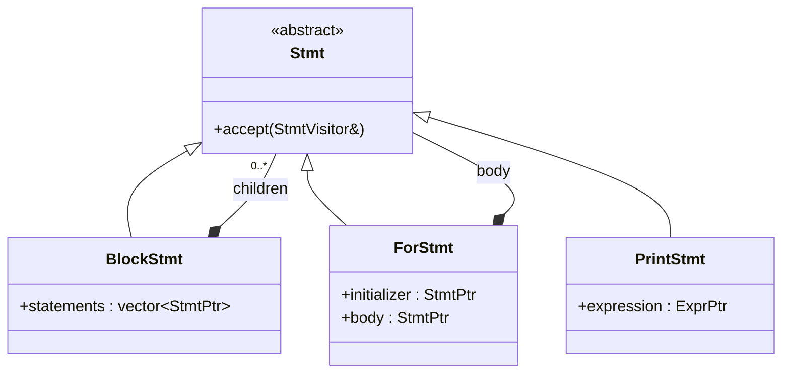
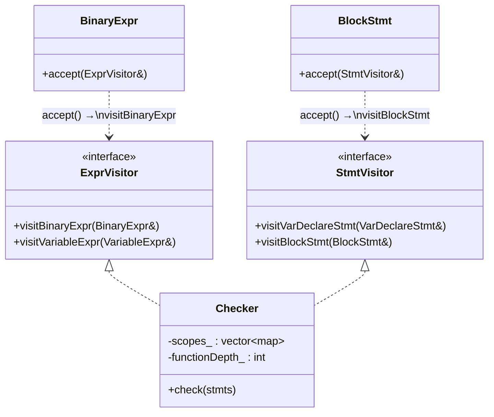
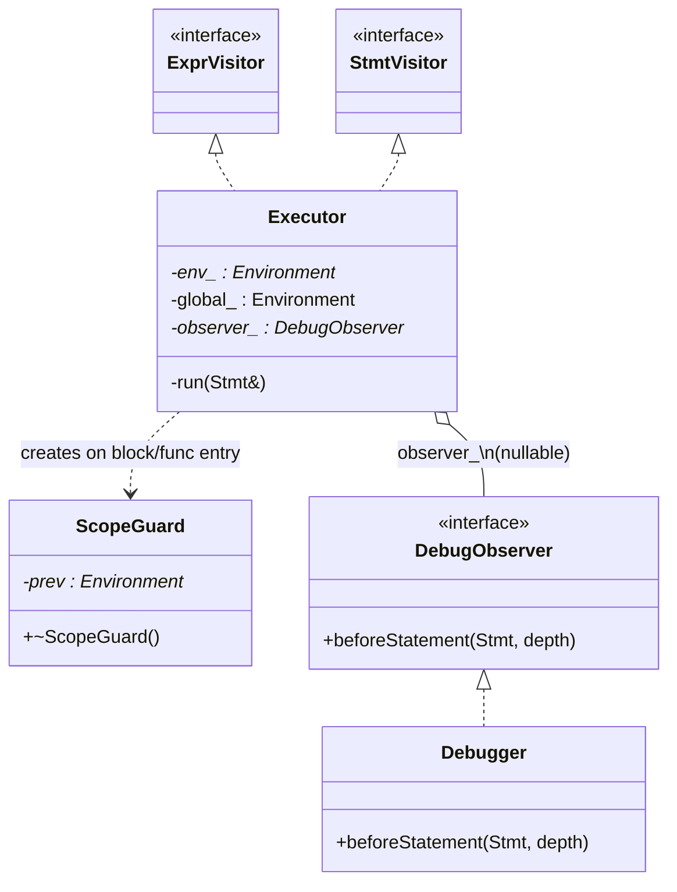
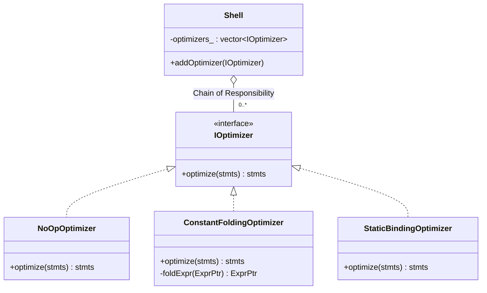
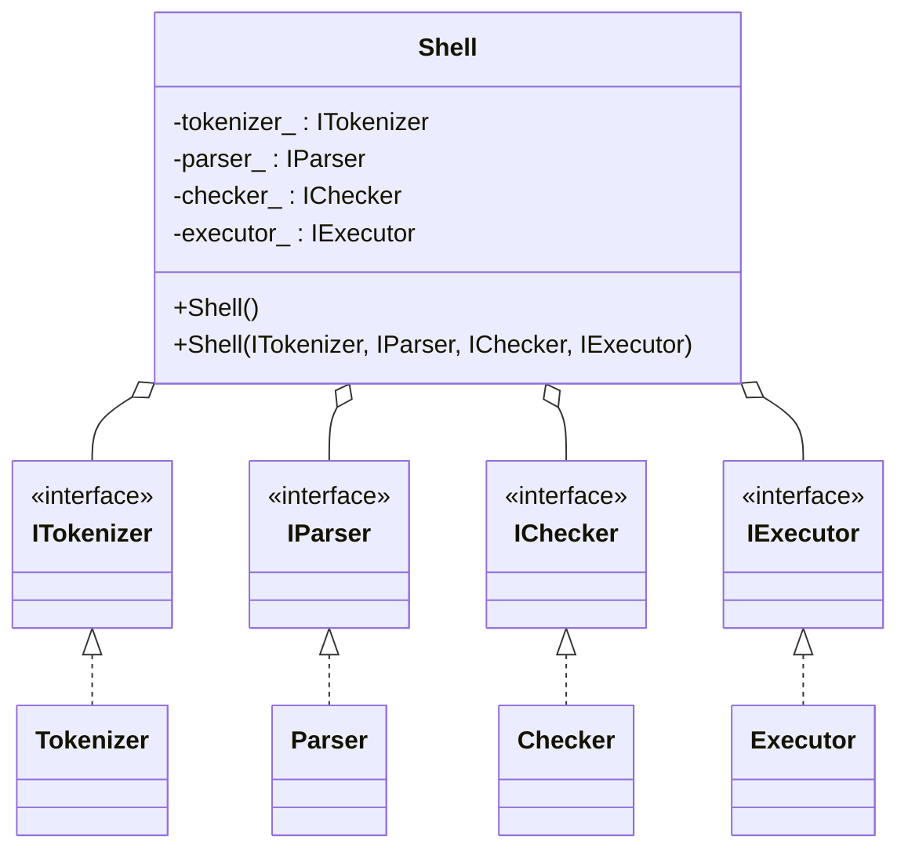

# CodeFab Interpreter

Code Review Agent (C++ 과정)

**팀명**: Build Clean
- 팀장: 우상욱 님
- 팀원: 최종원 님, 이수련 님, 임지웅 님 
- 팀명 의미 : 동작하는 코드에서 끝나지 않고, 읽기 쉽고 유지보수하기 좋은 클린 코드를 만들자.

### Ground Rule
- **17시 퇴근하기**
- 개발 전략
  - 전체 directory 구조 먼저 생성
  - 각 feature별 Branch를 만들어 개발 진행
  - 개발 branch naming: feature/assem.../sub 기능
  - 함수, 변수 명 snake 형식으로 개발
  - 필요한 클래스 생성 및 호출 등은 header에서 진행
  - 프로젝트 개발 시 대부분 소스에서 필요한 라이브러리는 common에서 개발
  - 가능한 모듈을 동시을 동시에 개발
- PR 전략 
  - git hub 전담 관리자: pr + merge 시 comment 확인 및 commit 점이 예쁘게 쌓일수 있게 각 comment의 퀄리티 확인 
  - PR template을 활용
  - Approve는 1명 이상
  - Build Check(Error 제거 확인) 후 PR
  - Master merge 전 개인 Branch에 Master Merge 후 Push
  - Merge PR 전 공유 후 순차적으로 PR 및 Merge
  - 16시 30분 이후 PR금지
  - 개발 branch는 pr 후 삭제한다.
- Comment 말머리  
   - [Must] 반드시 수정 필요
   - [Recommend] 권장 사항
   - [Question] 궁금한 점
   - [Nit] 사소한 제안
   - [Praise] 좋았던 점

## 담당

| 역할 | 담당 모듈 | 경로 |
|------|----------|------|
| 임지웅 님 | Tokenizer (어휘 분석) | `src/assembler/Tokenizer` |
| 최종원 님 | Parser (구문 분석) | `src/assembler/Parser` |
| 이수련 님 | Checker (의미 분석) | `src/checker/Checker` |
| 우상욱 님 | Executor (실행) | `src/executor/Executor` |
| 최종원 님 | Shell (REPL 통합) | `src/shell/Shell` |

---

## 파이프라인 구조

```
Shell       REPL — 줄 단위로 아래 파이프라인 반복 실행
   ↓
소스 코드 (한 줄)
   ↓
Tokenizer   소스 문자열 → Token 목록
   ↓
Parser      Token 목록 → AST (Stmt 목록)
   ↓
Checker     AST 의미 검증 (미선언 변수 등)
   ↓
Executor    AST 실행 → 출력
```

---

## 지원 문법

<details>
<summary><b>전체 문법 레퍼런스 펼치기</b></summary>

### 변수

```js
var x = 10;
var name = "Alice";
var flag = true;
var empty;        // 값 없이 선언 → nil
```

변수 값은 언제든 바꿀 수 있습니다.

```js
x = x + 1;
```

---

### 출력

```js
print x;
print "안녕하세요, " + name;
print 1 + 2;
```

| 저장된 값 | 출력 |
|:---------:|:----:|
| `10` (정수) | `10` |
| `3.14` | `3.14` |
| `true` / `false` | `true` / `false` |
| 선언만 하고 값 없음 | `nil` |
| `"hello"` | `hello` |

---

### 연산자

```js
// 산술
print 10 + 3;    // 13
print 10 / 3;    // 3.33333...
print 10 * 2;    // 20
print 10 - 4;    // 6
print 10 % 3;    // 1  (나머지, 실수 가능: 2.5 % 1.2 → 0.1)

// 문자열 이어붙이기
print "Hello" + ", " + "World";  // Hello, World

// 비교 (결과는 true / false)
print 5 > 3;     // true
print 3 >= 3;    // true
print 1 != 2;    // true
print 1 == 1;    // true

// 논리
print true and false;  // false
print true or false;   // true
print !true;           // false
```

> **참/거짓 판별**: `false`, `0`, `nil` 만 거짓입니다. 빈 문자열 `""` 도 참입니다.

---

### 조건문

```js
var score = 85;

if (score >= 90) {
    print "A";
} else if (score >= 80) {
    print "B";
} else {
    print "C";
}
```

`else if` 와 `else` 는 생략할 수 있습니다.

---

### 반복문

```js
for (var i = 0; i < 5; i = i + 1) {
    print i;
}
// 출력: 0  1  2  3  4
```

초기화 · 조건 · 증감식은 모두 생략 가능합니다.

```js
var i = 0;
for (; i < 3; i = i + 1) {
    print i;
}
```

---

### 함수

**선언**

```js
func greet(name) {
    print "Hello, " + name;
}
```

**호출**

```js
greet("Alice");   // Hello, Alice
```

**반환값**

```js
func add(a, b) {
    return a + b;
}

var result = add(3, 7);
print result;   // 10
```

`return` 없이 끝나거나 `return;` 이면 `nil` 을 반환합니다.

**재귀**

```js
func fact(n) {
    if (n <= 1) return 1;
    return n * fact(n - 1);
}

print fact(5);   // 120
```

---

### 배열

`array(n)` 으로 n개짜리 배열을 만듭니다. 초기값은 모두 `nil` 입니다.

```js
var arr = array(3);   // [nil, nil, nil]
```

**읽기 / 쓰기 / 전체 출력**

```js
arr[0] = 10;
arr[1] = 20;
arr[2] = 30;

print arr[0];             // 10
print arr[1] + arr[2];    // 50
print arr;                // [10, 20, 30]
```

인덱스에 변수나 식을 쓸 수 있습니다.

```js
var i = 1;
arr[i] = 99;
print arr[i - 1];   // 10
```

**배열을 함수에 넘기기**

배열은 참조로 전달되므로 함수 안에서 수정하면 밖에서도 반영됩니다.

```js
func fill(a, val) {
    a[0] = val;
    a[1] = val;
    a[2] = val;
}

var arr = array(3);
fill(arr, 7);
print arr[0];   // 7
```

---

### 블록과 스코프

중괄호 `{}` 안에서 선언한 변수는 블록 밖에서 보이지 않습니다.

```js
var x = 1;
{
    var x = 2;
    print x;   // 2  (블록 안)
}
print x;       // 1  (블록 밖, 원래 값)
```

---

### 주석

```js
// 이 줄은 실행되지 않습니다
var x = 10;   // 인라인 주석도 가능
```

---

### 예시 모음

**피보나치 수열**

```js
func fib(n) {
    if (n <= 1) return n;
    return fib(n - 1) + fib(n - 2);
}

for (var i = 0; i < 8; i = i + 1) {
    print fib(i);
}
// 0  1  1  2  3  5  8  13
```

**1부터 10까지 합산**

```js
var sum = 0;
for (var i = 1; i <= 10; i = i + 1) {
    sum = sum + i;
}
print sum;   // 55
```

**배열 합산**

```js
var arr = array(5);
for (var i = 0; i < 5; i = i + 1) {
    arr[i] = i + 1;
}

var sum = 0;
for (var i = 0; i < 5; i = i + 1) {
    sum = sum + arr[i];
}
print sum;   // 15
```

**문자열 반복**

```js
func repeat(s, n) {
    var result = "";
    for (var i = 0; i < n; i = i + 1) {
        result = result + s;
    }
    return result;
}

print repeat("ha", 3);   // hahaha
```

**최댓값 구하기**

```js
func max(a, b) {
    if (a > b) return a;
    return b;
}

print max(7, 13);   // 13
```

---

### ✅ 되는 것 · ❌ 안 되는 것



---

### ⚠️ 오류 메시지

오류가 나면 다음 메시지를 확인하세요.

<details>
<summary><b>문법 오류 (입력 직후 표시)</b></summary>

| 메시지 | 원인 |
|--------|------|
| `Unexpected character: X` | 지원하지 않는 문자 입력 |
| `Unsupported operator '++'. Use 'x = x + 1'.` | `++` 증감 연산자 사용 |
| `Unsupported operator '--'. Use 'x = x - 1'.` | `--` 감소 연산자 사용 |
| `Unsupported operator '+='. Use 'x = x + value'.` | `+=` 복합 대입 사용 |
| `Unsupported operator '-='. Use 'x = x - value'.` | `-=` 복합 대입 사용 |
| `Unsupported operator '*='. Use 'x = x * value'.` | `*=` 복합 대입 사용 |
| `Unsupported operator '/='. Use 'x = x / value'.` | `/=` 복합 대입 사용 |
| `Unterminated string` | 닫는 `"` 없이 문자열 끝남 |
| `Expected ')'` / `Expected '('` | 괄호 누락 |
| `Expected ';'` | 세미콜론 누락 |
| `Invalid assignment target.` | 대입 불가 대상에 `=` 사용 |
| `Expected function name.` | `func` 다음에 이름 없음 |

</details>

<details>
<summary><b>선언 오류 (실행 전 검사)</b></summary>

| 메시지 | 원인 |
|--------|------|
| `변수 'X'이(가) 이미 이 블록에서 선언되었습니다.` | 같은 블록 안에서 같은 이름으로 `var` 두 번 |
| `자신의 초기화식에서 지역변수 'X'을(를) 읽을 수 없습니다.` | `var x = x + 1;` 처럼 자기 자신 참조 |
| `Cannot use 'return' outside of a function.` | 함수 밖에서 `return` 사용 |
| `Duplicate parameter name 'X' in function 'F'.` | 파라미터 이름 중복 |

</details>

<details>
<summary><b>런타임 오류 (실행 중 발생)</b></summary>

| 메시지 | 원인 |
|--------|------|
| `Undefined variable 'X'.` | 선언하지 않은 변수 사용 |
| `Division by zero.` | `0` 으로 나누기 |
| `Operands must be numbers.` | 숫자가 아닌 값에 산술 연산 |
| `Operands must be two numbers or two strings.` | `+` 에 숫자+문자열 혼용 |
| `'X' is not a function.` | 변수를 함수처럼 호출 |
| `Undefined function 'X'.` | 선언하지 않은 함수 호출 |
| `Expected N arguments but got M.` | 인자 개수 불일치 |
| `Value is not an array.` | 배열이 아닌 변수에 `[ ]` 사용 |
| `Array index must be an integer.` | 인덱스에 정수가 아닌 값 사용 |
| `Array index out of range.` | 배열 크기를 벗어난 인덱스 |
| `array() expects exactly 1 argument.` | `array()` 인자 개수 오류 |
| `array size must be a non-negative integer.` | `array` 크기에 음수·소수·문자열 등 사용 |

</details>

</details>

---

## 빌드 및 실행

**환경**: Visual Studio 2022, Windows, C++20

진입점은 빌드 구성에 따라 분리된다. `vcxproj`의 `ExcludedFromBuild`로 구성별로 전환된다.

#### Debug 빌드 — 테스트 실행 (`test_main.cpp`)

```
msbuild Project17.vcxproj /p:Configuration=Debug /p:Platform=x64

# 전체 테스트 실행
.\x64\Debug\Project17.exe

# 특정 테스트만 실행
.\x64\Debug\Project17.exe --gtest_filter=ShellTest.*

# Shell(REPL) 대화형 실행
.\x64\Debug\Project17.exe --shell
```

#### Release 빌드 — 공장 제어 쉘 (`main.cpp`)

```
msbuild Project17.vcxproj /p:Configuration=Release /p:Platform=x64
```

Release 빌드의 실행 파일이 **공장 제어 쉘(factory)** 이며, 명령행 인자로 모드를 선택한다.

테스트 프레임워크: Google Test / GoogleMock 1.11.0 (NuGet)

---

## 공장 제어 쉘 (Factory Control Shell)

공장 제어 쉘은 Interpreter Factory(Tokenizer → Parser → Checker → Optimizer\* → Executor)를
운용·점검하는 인터페이스로, 세 가지 실행 모드를 제공한다.

| 모드 | 명령 | 설명 |
|------|------|------|
| 프롬프트 모드 (REPL) | `factory` | 소스를 한 줄씩 입력하는 대화형 실행. 전역 변수는 세션 종료까지 유지 |
| 파일 모드 | `factory run <path>` | 소스 파일을 읽어 한 번에 실행 |
| 디버그 모드 | `factory debug <path>` | 소스를 Stmt 단위로 멈추며 단계 실행 |

> 아래 예시의 `factory`는 `.\x64\Release\Project17.exe`를 가리킨다.

### 1. 프롬프트 모드 (REPL)

인자 없이 실행하면 진입한다. `> ` 프롬프트에 코드를 입력하면 즉시 실행되고, `{ }`가 닫힐 때까지
여러 줄을 누적한다. 입력 스트림이 끝나면(EOF) 종료한다.

```
$ factory
> var a = 3;
> var b = 7;
> print a + b;
10
```

### 2. 파일 모드

```
$ factory run ./scripts/hello.txt
```

- 파일이 존재하지 않으면 `Error: cannot open file '<path>'` 출력 후 종료 코드 `1`
- 실행 중 런타임 오류가 나면 `[line N] ...` 형식으로 오류 줄 번호와 함께 출력 후 **즉시 종료**

### 3. 디버그 모드

```
$ factory debug ./scripts/test.txt
[DEBUG] loaded source: ./scripts/test.txt
[DEBUG] stopped at line 1 -> var a = 3;
> step
[DEBUG] stopped at line 2 -> var b = a + 1;
> break 7
[DEBUG] breakpoint set at line 7
> continue
[DEBUG] stopped at line 7 (breakpoint) -> print a;
```

stepping 단위는 Stmt 기준이며, `watch`는 변수 저장소에서 직접 조회한다.

#### Stepping 명령어

| 명령어 | 설명 |
|--------|------|
| `step` | 현재 Stmt 실행 후 다음 Stmt 에서 정지 (블록 내부로 진입) |
| `next` | 현재 Stmt 실행 (블록/함수 내부로 진입하지 않고 건너뜀) |
| `break <line>` | 해당 줄에 breakpoint 설정 |
| `breakpoints` | 현재 설정된 breakpoint 목록 출력 |
| `remove <line>` | breakpoint 해제 |
| `continue` | 다음 breakpoint 까지 실행 |

#### Watch 명령어

| 명령어 | 설명 |
|--------|------|
| `watch <name>` | 변수를 감시 목록에 추가 (정지할 때마다 값 자동 출력) |
| `unwatch <name>` | 감시 목록에서 제거 |
| `watches` | 현재 감시 중인 변수와 값 출력 (가장 인접한 스코프 기준) |
| `inspect` | 현재 스코프 체인의 모든 변수와 타입 출력 (`[local]` / `[global]`) |

```
> watch a
[WATCH] now watching 'a'
> step
[DEBUG] stopped at line 5 -> a = a + 1;
[WATCH] a = 3
> inspect
--- current scope variables ---
[local] b = 10 (Number)
[global] a = 4 (Number)
```

---

## 디렉터리 구조

```
src/
├── common/       Token, Expr, Stmt 공유 타입
├── assembler/    Tokenizer, Parser
├── checker/      Checker
├── executor/     Executor, Environment
├── optimizer/    IOptimizer, ConstantFoldingOptimizer, StaticBindingOptimizer
└── shell/        Shell (REPL), Debugger

test/
├── Tokenizer_test.cpp
├── Parser_test.cpp
├── Checker_test.cpp
├── Executor_test.cpp
├── Function_test.cpp              — 함수 선언·호출·재귀 테스트
├── Array_test.cpp                 — 배열 생성·읽기·쓰기·출력 테스트
├── Shell_test.cpp                 — Shell 고유 동작 테스트 (실제 구현 사용)
├── Script_test.cpp                — 전체 파이프라인 End-to-End 통합 테스트
├── StaticBinding_test.cpp         — StaticBindingOptimizer 테스트
├── ConstantFoldingOptimizer_test.cpp  — ConstantFoldingOptimizer 단위 테스트
├── ShellConstantFoldingOptimizer_test.cpp — Shell + CFO 통합 테스트
├── Debug_test.cpp                 — Debugger 명령어 테스트
└── FileMode_test.cpp              — 파일 모드 테스트
```

---

## 기능별 상세 분석

### 1. Tokenizer (어휘 분석)

**담당 파일**: `src/assembler/Tokenizer.h/.cpp`  
**인터페이스**: `tokenize(string) → vector<Token>`

소스 문자열을 한 번만 순회(`Scanner` 내부 클래스)하여 Token 목록을 생성한다.

#### 인식하는 토큰

| 분류 | 목록 |
|------|------|
| 키워드 | `var` `if` `else` `for` `true` `false` `and` `or` `print` `func` `return` |
| 단일 연산자 | `+` `-` `*` `/` `%` `!` `=` `>` `<` `(` `)` `{` `}` `[` `]` `;` `,` |
| 복합 연산자 | `==` `!=` `>=` `<=` |
| 리터럴 | NUMBER(double), STRING, IDENTIFIER |

#### 주요 처리 규칙

- **공백**: 스페이스·탭·`\r`은 무시, `\n`은 줄 번호(`line`) 증가
- **줄 주석**: `//` 이후부터 줄 끝(`\n`)까지 `skipLineComment()`로 건너뜀. `/` 단독은 나눗셈 연산자
- **문자열**: `"..."` — `lexeme`은 따옴표 포함, `literal`은 따옴표 제외
- **숫자**: 정수 및 소수점 형식 모두 `double`로 저장 (`"3.14"` → `3.14`)
- **식별자**: 영문자 또는 `_`로 시작, 이후 영숫자 또는 `_` 허용. 키워드 테이블에 일치하면 해당 키워드 토큰, 아니면 `IDENTIFIER`
- **키워드 접두사**: `variable`은 `IDENTIFIER`, `truex`는 `IDENTIFIER` (완전 일치만 키워드)

#### 오류 처리

| 상황 | 예외 메시지 |
|------|------------|
| 미지원 문자 | `"[line N] Unexpected character: X"` |
| 닫히지 않은 문자열 | `"[line N] Unterminated string"` |

---

### 2. Parser (구문 분석)

**담당 파일**: `src/assembler/Parser.h/.cpp`  
**인터페이스**: `parse(vector<Token>) → vector<StmtPtr>`

재귀 하향(Recursive Descent) 방식으로 Token 목록을 AST(`Stmt` 목록)로 변환한다.

#### 표현식 우선순위 (낮은 순 → 높은 순)

| 단계 | 메서드 | 연산자 |
|------|--------|--------|
| 1 | `assignment` | `=` (우결합), `arr[i] = val` |
| 2 | `logicalOr` | `or` |
| 3 | `logicalAnd` | `and` |
| 4 | `equality` | `==` `!=` |
| 5 | `comparison` | `>` `>=` `<` `<=` |
| 6 | `term` | `+` `-` |
| 7 | `factor` | `*` `/` `%` |
| 8 | `unary` | `!` `-` (우결합) |
| 9 | `call` | `f(args)`, `arr[i]` |
| 10 | `primary` | 리터럴, 변수, `(expr)` |

#### 설계 포인트

- `parseBinaryLeft<NodeType>` 템플릿으로 좌결합 이진 표현식을 한 곳에서 처리
- `LogicalExpr`와 `BinaryExpr`를 별도 노드로 분리 — Executor에서 단락 평가(short-circuit) 구현을 위해
- 대입 좌변이 `VariableExpr`가 아니면 즉시 오류 (`"Invalid assignment target."`)
- `for` 문의 초기화·조건·증감식은 모두 선택적(nullable)

#### 오류 처리

모든 구문 오류는 `std::runtime_error("[line N] 메시지")` 형태로 던진다.

#### 디자인 패턴 — Composite

AST 노드가 다른 노드를 자식으로 포함한다. `BlockStmt`는 `Stmt` 목록을, `BinaryExpr`는 두 `Expr` 자식을 갖는다. 모든 노드가 동일한 `accept()` 인터페이스를 제공하므로 Visitor가 리프/복합 노드를 구분하지 않고 재귀 순회할 수 있다.



---

### 3. Checker (의미 분석)

**담당 파일**: `src/checker/Checker.h/.cpp`  
**인터페이스**: `check(vector<StmtPtr>) → void`

AST를 순회하여 실행 전에 검출 가능한 의미 오류를 `CheckError`(행 번호 포함)로 던진다.

#### 스코프 관리

스코프를 `vector<unordered_map<string, bool>>`로 관리한다. `bool` 값은 변수의 초기화 완료 여부(`false` = 선언만 됨, `true` = 초기화 완료).

```
declare(name)    → 현재 스코프에 false 등록 (중복 시 오류)
define(name)     → 현재 스코프의 값을 true로 변경
resolveVar(name) → 안쪽 스코프부터 탐색; false이면 자기 참조 오류
checkStmt(s)     → s.accept(*this) 래퍼
checkExpr(e)     → e.accept(*this) 래퍼
```

`ExprVisitor`·`StmtVisitor`를 `public` 상속하여 외부에서도 Visitor를 직접 활용할 수 있다.

#### 검출하는 오류

| 상황 | 오류 메시지 |
|------|------------|
| 같은 블록 내 변수 중복 선언 | `"변수 'X'이(가) 이미 이 블록에서 선언되었습니다."` |
| 초기화식에서 자기 자신 참조 (`var x = x;`) | `"자신의 초기화식에서 지역변수 'X'을(를) 읽을 수 없습니다."` |

#### 검출하지 않는 항목

- **미선언 변수 사용**: 글로벌 스코프 변수는 추적하지 않으므로 런타임에 Executor가 처리
- **대입 대상 변수 존재 여부**: `visitAssignExpr`에서 대입 대상(좌변)은 검사하지 않고 우변 값 표현식만 검사. 글로벌 변수 대입은 Executor가 처리
- **타입 오류**: 타입 검사는 Executor 담당
- **다른 블록 스코프에서의 동명 변수(shadowing)**: 정상 허용

#### 디자인 패턴 — Visitor

`ExprVisitor`·`StmtVisitor` 인터페이스를 구현해 AST를 순회한다. 노드 클래스를 수정하지 않고 새로운 의미 검사 로직을 추가할 수 있으며, 각 노드 타입별 처리(`visitBinaryExpr`, `visitIfStmt` 등)가 Checker 클래스 안에 집중된다.



---

### 4. Executor (실행)

**담당 파일**: `src/executor/Executor.h/.cpp`  
**인터페이스**: `execute(vector<StmtPtr>, ostream&) → void`

AST를 Visitor 패턴으로 순회하며 실행하고 결과를 `ostream`으로 출력한다.

#### 스코프 관리 (Environment)

```
Environment
├── values: map<string, LiteralValue>
└── enclosing: Environment*   ← 상위 스코프 포인터

define(name, val)   현재 스코프에 새 변수 정의 (shadowing 허용)
get(name)           현재 → 상위 재귀 탐색; 없으면 runtime_error
assign(name, val)   현재 → 상위 재귀 탐색 후 덮어쓰기; 없으면 runtime_error
```

블록·for 진입 시 새 `Environment`를 스택에 쌓고, `ScopeGuard` RAII로 블록 탈출 시 이전 환경으로 자동 복구한다.

#### 연산자 동작

| 연산자 | 동작 |
|--------|------|
| `+` | 두 피연산자가 모두 string이면 문자열 연결, 모두 number이면 덧셈, 혼합이면 오류 |
| `-` `*` `/` `>` `>=` `<` `<=` | number만 허용, bool·string이면 오류 |
| `==` `!=` | 타입 무관 동등 비교 (`std::variant` 비교) |
| `!` | truthy 판정 후 반전 |
| `-` (단항) | number만 허용 |
| `and` | 좌변이 falsy이면 좌변 반환, 아니면 우변 반환 (단락 평가) |
| `or` | 좌변이 truthy이면 좌변 반환, 아니면 우변 반환 (단락 평가) |

#### Truthy 규칙

`false`, `0.0`, `nil`(monostate)만 falsy. 문자열은 빈 문자열도 truthy.

#### 출력 형식 (`stringify`)

| LiteralValue | 출력 |
|--------------|------|
| `double` 정수 (`5.0`) | `"5"` |
| `double` 실수 (`3.14`) | `"3.14"` |
| `bool true` | `"true"` |
| `bool false` | `"false"` |
| `string` | 그대로 출력 |
| `ArrayPtr` | `"[e0, e1, ...]"` — 원소를 재귀적으로 stringify |
| `ArrayPtr` (순환 참조) | `"[...]"` — 이미 방문한 배열은 `visited` 집합으로 감지 |

#### 런타임 오류

모든 런타임 오류는 `"[line N] 메시지"` 형태로 던진다.

| 상황 | 메시지 |
|------|--------|
| 미정의 변수 | `"[line N] Undefined variable 'NAME'."` |
| 미정의 함수 | `"[line N] Undefined function 'NAME'."` |
| 0 나누기 / 0 모듈로 | `"[line N] Division by zero."` |
| 단항 `-`에 비숫자 | `"[line N] Operand must be a number."` |
| `+` 타입 불일치 | `"[line N] Operands must be two numbers or two strings."` |
| 숫자 연산에 비숫자 | `"[line N] Operands must be numbers."` |
| 배열 범위 초과 | `"[line N] Array index out of range."` |
| 배열이 아닌 값에 인덱싱 | `"[line N] Value is not an array."` |

#### 디자인 패턴 — Visitor · RAII/Scope Guard · Observer

**Visitor**: `ExprVisitor`·`StmtVisitor`를 `private` 상속하여 각 노드 타입별 실행 로직을 단일 클래스 안에 집중시킨다. 노드 구조 변경 없이 실행 동작을 독립적으로 수정할 수 있다.

**RAII / Scope Guard**: 블록·함수 진입 시 `env_`를 교체하고 소멸자에서 자동 복원한다. `ReturnException` 같은 비-`std::exception` 예외가 던져져도 스택 언와인딩으로 환경이 오염되지 않는다.

**Observer**: `DebugObserver*`가 `nullptr`이면 런타임 오버헤드 없이 실행된다. 디버그 모드에서 `Debugger`를 꽂으면 매 Stmt 실행 전 `beforeStatement()`가 호출된다.



### 5. Optimizer (최적화 패스)

**담당 파일**: `src/optimizer/`  
**인터페이스**: `optimize(vector<StmtPtr>) → vector<StmtPtr>`

AST를 받아 최적화된 AST를 반환한다. Strategy 패턴으로 여러 패스를 체인으로 연결할 수 있다(`Shell::addOptimizer()`).

| 구현체 | 동작 |
|--------|------|
| `NoOpOptimizer` | 아무 변환 없이 원본 반환 (Null Object 패턴) |
| `ConstantFoldingOptimizer` | 순수 리터럴 서브트리를 컴파일 타임에 미리 계산하여 `LiteralExpr` 하나로 교체 |
| `StaticBindingOptimizer` | 변수 참조 깊이(distance)를 정적 분석으로 계산 — Executor에서 O(1) 스코프 접근 가능 |

#### 디자인 패턴 — Strategy · Chain of Responsibility · Null Object

- **Strategy**: `IOptimizer` 인터페이스 뒤로 알고리즘을 숨겨 Shell 코드 변경 없이 교체·추가 가능
- **Chain of Responsibility**: `addOptimizer()`로 여러 패스를 순서대로 연결하고, 각 패스의 출력이 다음 패스의 입력이 됨
- **Null Object**: `NoOpOptimizer`로 null 체크 없이 파이프라인이 항상 동일한 흐름으로 동작



#### ConstantFoldingOptimizer 예시

```
// 최적화 전
for (var i = 0; i < 100; i = i + 1) {
    total = total + (1 - 2 * 3 * 4 * 5 / 6 + 7 + 8 + 9) % 1000 % 30;
}
// 최적화 후 (상수식 10개 → LiteralExpr(5) 1개)
for (var i = 0; i < 100; i = i + 1) {
    total = total + 5;
}
```

---

### 6. Shell (REPL)

**담당 파일**: `src/shell/Shell.h/.cpp`

4단계 파이프라인 전체를 묶어 한 줄씩 실행하는 REPL(Read-Eval-Print Loop)이다.

#### 공개 인터페이스

| 메서드 | 설명 |
|--------|------|
| `run(istream&, ostream&)` | `"> "` 프롬프트를 출력하며 입력 스트림에서 줄 단위로 읽어 실행 |
| `runLine(string) → string` | 한 줄을 실행하고 출력 결과를 문자열로 반환 (테스트 전용) |

#### 동작 방식

- 빈 줄은 파이프라인을 거치지 않고 즉시 반환
- 오류(`std::exception`) 발생 시 예외를 캡처하여 오류 메시지를 `ostream`에 출력 후 다음 줄 계속 처리 — Shell이 크래시되지 않고 다음 입력을 정상 처리함
- **실행 상태(변수·함수 정의)는 줄 간에 유지됨** — `Executor` 인스턴스가 Shell과 동일한 생명주기를 가지므로 `global_` 환경과 `functions_` 테이블이 `runLine`/`run` 호출 사이에 유지됨
- **멀티라인 입력** — `run()`은 중괄호 깊이를 추적하여 `{`·`}`가 균형을 이룰 때까지 줄을 누적한 뒤 한 번에 실행한다. 누적 중에는 `"... "` 보조 프롬프트를 표시한다

#### 디자인 패턴 — Dependency Injection

`Shell`이 구체 클래스 대신 인터페이스(`ITokenizer`, `IParser`, `IChecker`, `IExecutor`)에 의존한다. 기본 생성자는 구체 구현을 생성하고, DI 생성자는 Mock 객체를 주입받아 테스트 시 파이프라인 특정 단계를 격리 검증할 수 있다.



#### 테스트 구조

`Shell_test.cpp`는 Mock 없이 실제 구현체를 사용하여 Shell 고유 동작을 검증한다.  
전체 파이프라인 End-to-End 검증은 `Script_test.cpp`에서 수행한다.

---

