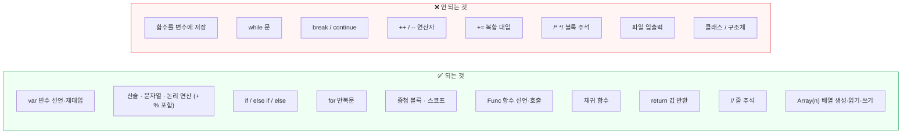

<div align="center">

# 🛠️ CodeFab Interpreter

**직접 만든 언어를 실시간으로 실행하는 인터프리터**


</div>

---

## ▶️ 실행 방법

`Project17.exe` 를 더블클릭하거나 터미널에서 실행하면 바로 시작됩니다.

```
> _
```

`>` 프롬프트가 뜨면 코드를 입력하세요. **Enter** 로 즉시 실행됩니다.  
종료하려면 `Ctrl + C` 또는 창을 닫으세요.

> 입력한 변수·함수는 종료 전까지 계속 유지됩니다.

---

## 📝 기본 사용법

### 변수

```js
var x = 10;
var name = "Alice";
var flag = true;
var empty;        // 값 없이 선언 → nil
```

변수 값은 언제든 바꿀 수 있습니다.

```js
x = x + 1;
```

---

### 출력

```js
print x;
print "안녕하세요, " + name;
print 1 + 2;
```

| 저장된 값 | 출력 |
|:---------:|:----:|
| `10` (정수) | `10` |
| `3.14` | `3.14` |
| `true` / `false` | `true` / `false` |
| 선언만 하고 값 없음 | `nil` |
| `"hello"` | `hello` |

---

### 연산자

```js
// 산술
print 10 + 3;    // 13
print 10 / 3;    // 3.33333...
print 10 * 2;    // 20
print 10 - 4;    // 6
print 10 % 3;    // 1  (나머지, 실수 가능: 2.5 % 1.2 → 0.1)

// 문자열 이어붙이기
print "Hello" + ", " + "World";  // Hello, World

// 비교 (결과는 true / false)
print 5 > 3;     // true
print 3 >= 3;    // true
print 1 != 2;    // true
print 1 == 1;    // true

// 논리
print true and false;  // false
print true or false;   // true
print !true;           // false
```

> **참/거짓 판별**: `false`, `0`, `nil` 만 거짓입니다. 빈 문자열 `""` 도 참입니다.

---

### 조건문

```js
var score = 85;

if (score >= 90) {
    print "A";
} else if (score >= 80) {
    print "B";
} else {
    print "C";
}
```

`else if` 와 `else` 는 생략할 수 있습니다.

---

### 반복문

```js
for (var i = 0; i < 5; i = i + 1) {
    print i;
}
// 출력: 0  1  2  3  4
```

초기화 · 조건 · 증감식은 모두 생략 가능합니다.

```js
var i = 0;
for (; i < 3; i = i + 1) {
    print i;
}
```

---

### 함수

**선언**

```js
Func greet(name) {
    print "Hello, " + name;
}
```

**호출**

```js
greet("Alice");   // Hello, Alice
```

**반환값**

```js
Func add(a, b) {
    return a + b;
}

var result = add(3, 7);
print result;   // 10
```

`return` 없이 끝나거나 `return;` 이면 `nil` 을 반환합니다.

**재귀**

```js
Func fact(n) {
    if (n <= 1) return 1;
    return n * fact(n - 1);
}

print fact(5);   // 120
```

---

### 배열

`Array(n)` 으로 n개짜리 배열을 만듭니다. 초기값은 모두 `nil` 입니다.

```js
var arr = Array(3);   // [nil, nil, nil]
```

**읽기 / 쓰기**

```js
arr[0] = 10;
arr[1] = 20;
arr[2] = 30;

print arr[0];             // 10
print arr[1] + arr[2];    // 50
```

인덱스에 변수나 식을 쓸 수 있습니다.

```js
var i = 1;
arr[i] = 99;
print arr[i - 1];   // 10
```

**배열을 함수에 넘기기**

배열은 참조로 전달되므로 함수 안에서 수정하면 밖에서도 반영됩니다.

```js
Func fill(a, val) {
    a[0] = val;
    a[1] = val;
    a[2] = val;
}

var arr = Array(3);
fill(arr, 7);
print arr[0];   // 7
```

---

### 블록과 스코프

중괄호 `{}` 안에서 선언한 변수는 블록 밖에서 보이지 않습니다.

```js
var x = 1;
{
    var x = 2;
    print x;   // 2  (블록 안)
}
print x;       // 1  (블록 밖, 원래 값)
```

---

### 주석

```js
// 이 줄은 실행되지 않습니다
var x = 10;   // 인라인 주석도 가능
```

---

## 💡 예시 모음

### 피보나치 수열

```js
Func fib(n) {
    if (n <= 1) return n;
    return fib(n - 1) + fib(n - 2);
}

for (var i = 0; i < 8; i = i + 1) {
    print fib(i);
}
// 0  1  1  2  3  5  8  13
```

### 1부터 10까지 합산

```js
var sum = 0;
for (var i = 1; i <= 10; i = i + 1) {
    sum = sum + i;
}
print sum;   // 55
```

### 문자열 반복

```js
Func repeat(s, n) {
    var result = "";
    for (var i = 0; i < n; i = i + 1) {
        result = result + s;
    }
    return result;
}

print repeat("ha", 3);   // hahaha
```

### 최댓값 구하기

```js
Func max(a, b) {
    if (a > b) return a;
    return b;
}

print max(7, 13);   // 13
```

### 배열 합산

```js
var arr = Array(5);
for (var i = 0; i < 5; i = i + 1) {
    arr[i] = i + 1;
}

var sum = 0;
for (var i = 0; i < 5; i = i + 1) {
    sum = sum + arr[i];
}
print sum;   // 15
```

---

## ✅ 되는 것 · ❌ 안 되는 것



---

## ⚠️ 오류 메시지

오류가 나면 다음 메시지를 확인하세요.

<details>
<summary><b>문법 오류 (입력 직후 표시)</b></summary>

| 메시지 | 원인 |
|--------|------|
| `Unexpected character: X` | 지원하지 않는 문자 입력 |
| `Unterminated string` | 닫는 `"` 없이 문자열 끝남 |
| `Expected ')'` / `Expected '('` | 괄호 누락 |
| `Expected ';'` | 세미콜론 누락 |
| `Invalid assignment target.` | 대입 불가 대상에 `=` 사용 |
| `Expected function name.` | `Func` 다음에 이름 없음 |

</details>

<details>
<summary><b>선언 오류 (실행 전 검사)</b></summary>

| 메시지 | 원인 |
|--------|------|
| `변수 'X'이(가) 이미 이 블록에서 선언되었습니다.` | 같은 블록 안에서 같은 이름으로 `var` 두 번 |
| `자신의 초기화식에서 지역변수 'X'을(를) 읽을 수 없습니다.` | `var x = x + 1;` 처럼 자기 자신 참조 |
| `Cannot use 'return' outside of a function.` | 함수 밖에서 `return` 사용 |
| `Duplicate parameter name 'X' in function 'F'.` | 파라미터 이름 중복 |

</details>

<details>
<summary><b>런타임 오류 (실행 중 발생)</b></summary>

| 메시지 | 원인 |
|--------|------|
| `Undefined variable 'X'.` | 선언하지 않은 변수 사용 |
| `Division by zero.` | `0` 으로 나누기 |
| `Operands must be numbers.` | 숫자가 아닌 값에 산술 연산 |
| `Operands must be two numbers or two strings.` | `+` 에 숫자+문자열 혼용 |
| `'X' is not a function.` | 변수를 함수처럼 호출 |
| `Undefined function 'X'.` | 선언하지 않은 함수 호출 |
| `Expected N arguments but got M.` | 인자 개수 불일치 |
| `Value is not an array.` | 배열이 아닌 변수에 `[ ]` 사용 |
| `Array index must be an integer.` | 인덱스에 정수가 아닌 값 사용 |
| `Array index out of range.` | 배열 크기를 벗어난 인덱스 |
| `Array() expects exactly 1 argument.` | `Array()` 인자 개수 오류 |
| `Array size must be a non-negative integer.` | `Array` 크기에 음수·소수·문자열 등 사용 |

</details>
